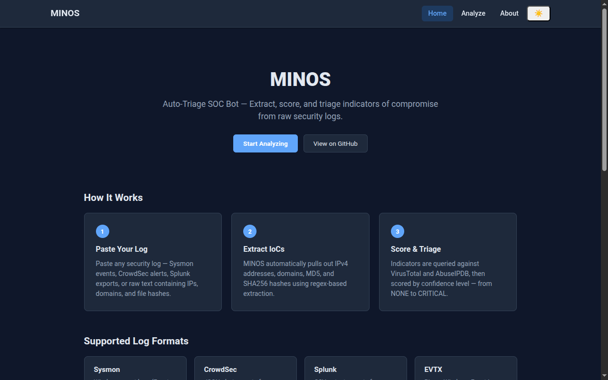
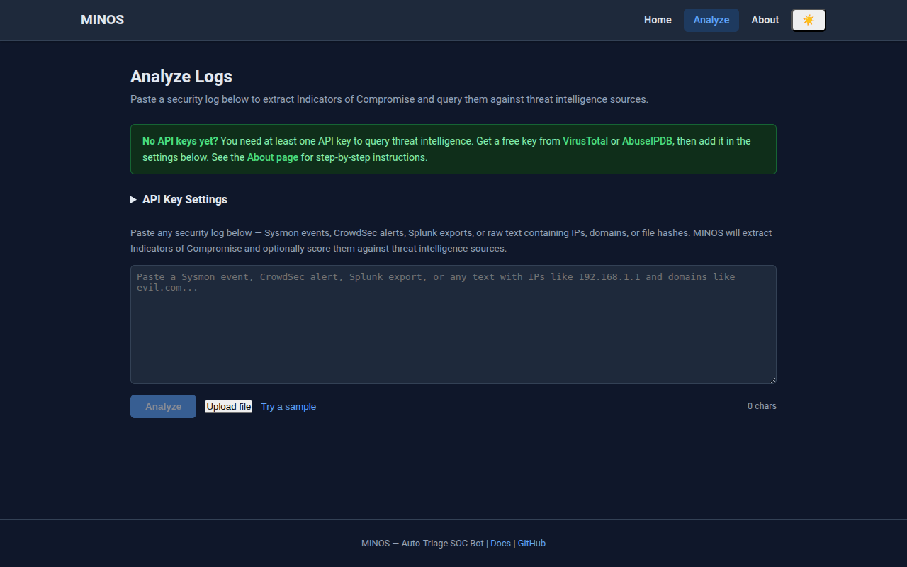
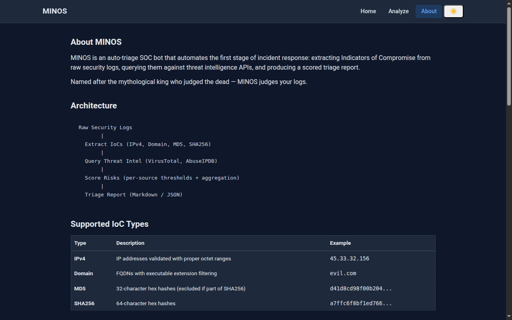

# MINOS — Auto-Triage SOC Bot

**MINOS** extracts Indicators of Compromise (IoCs) from raw security logs, queries them against threat intelligence APIs, and produces a clean, scorable triage report — in Markdown or JSON.

> Named after the mythological king who judged the dead. MINOS judges your logs.

## Screenshots

<table>
  <tr>
    <td align="center"></td>
    <td align="center"></td>
    <td align="center"></td>
  </tr>
  <tr>
    <td align="center">Home</td>
    <td align="center">Analyze</td>
    <td align="center">About</td>
  </tr>
</table>

## Architecture

```
┌─────────────────┐     ┌──────────────────┐     ┌─────────────────┐
│   Raw Security   │     │   MINOS Engine   │     │   Triage Report  │
│      Logs        │────▶│                  │────▶│                  │
│  • Sysmon        │     │  1. Extract IoCs │     │  • Markdown      │
│  • CrowdSec      │     │  2. Query Intel  │     │  • JSON (SIEM)   │
│  • Splunk Export │     │  3. Score Risks  │     │                  │
│  • Raw Text      │     │  4. Format       │     │                  │
└─────────────────┘     └──────────────────┘     └─────────────────┘
                                │
                        ┌───────┴───────┐
                        │               │
                   ┌─────────┐   ┌──────────┐
                   │VirusTotal│   │AbuseIPDB │
                   └─────────┘   └──────────┘
```

## Features

- **IoC Extraction** — IPv4, domains, MD5, and SHA256 hashes via regex from any text-based log
- **EVTX Support** — Structured parsing of Windows Event Log (.evtx) files with EventID-aware field extraction
- **Async Threat Intel** — Concurrent lookups against VirusTotal and AbuseIPDB
- **Risk Scoring** — Multi-source confidence-based scoring with aggregation
- **Dual Output** — Markdown reports or SIEM-ready JSON
- **Web UI** — Browser-based interface with dark mode and responsive layout
- **Security Hardened** — CSP headers, sessionStorage key storage, pinned dependencies, sanitized error responses
- **Zero Boilerplate** — Pipe a log in, get a report out

## Quick Start

### 1. Install

```bash
git clone git@github.com:KiZINnO/MINOS.git
cd MINOS

# Recommended: install inside a virtual environment
python3 -m venv .venv
source .venv/bin/activate

pip install -e .
```

After install, the `minos` command is available on your PATH:

```bash
$ minos --help
Usage: minos [OPTIONS] [INPUT]
...
```

If `minos` isn't found, use the module runner fallback: `python3 -m minos.cli ...`

### 2. Configure API Keys

```bash
cp .env.example .env
```

Edit `.env` and add your keys:

| Service | Register At | Key Variable |
|---------|------------|--------------|
| VirusTotal | https://www.virustotal.com/gui/join-us | `VIRUSTOTAL_API_KEY` |
| AbuseIPDB | https://www.abuseipdb.com/register | `ABUSEIPDB_API_KEY` |

You can skip API keys for extraction-only mode with `--no-intel`.

### 3. Run

```bash
# From a text-based log file
minos sample_logs/sysmon_1.txt --no-intel

# From a Windows EVTX event log (structured EventID parsing)
minos sample_logs/DE_RDP_Tunnel_5156.evtx --no-intel

# Inline text
minos -t "Suspicious connection from 45.33.32.156 to evil.com" --no-intel

# JSON output for SIEM ingestion
minos sample_logs/sysmon_1.txt -f json -o report.json --no-intel

# Extract only (skip threat intel lookups)
minos sample_logs/crowdsec_alert.json --no-intel

# With live threat intel (requires API keys in .env)
minos sample_logs/sysmon_1.txt
```

## Web UI

MINOS includes a browser-based interface for interactive analysis with a multi-page layout, dark mode support, and security-hardened API proxying.

### Setup

```bash
cd web
npm install
```

### Development

Start the Vite dev server (frontend at `:5173`, proxying API calls to `:8000`):

```bash
# Terminal 1 — backend proxy
cd .. && source .venv/bin/activate && uvicorn api.index:app --port 8000

# Terminal 2 — frontend
cd web && npm run dev
```

Open `http://localhost:5173` in your browser.

### Build

```bash
npm run build    # outputs to web/dist/
npm run preview  # preview the production build locally
```

### Deploy to Vercel

1. Push your repo to GitHub
2. Import the repository in the [Vercel dashboard](https://vercel.com)
3. Framework preset: **Vite**
4. Root directory: `web`
5. Build command: `npm run build`
6. Output directory: `dist`

The FastAPI backend (`api/index.py`) deploys as a Vercel serverless function. Users bring their own VirusTotal/AbuseIPDB API keys (configured in the web UI).

> **Note:** SPA routing requires `vercel.json` to use `routes` (not `rewrites`) for client-side URL fallback. The current config maps `/(.*)` to `/web/dist/$1` — if your /analyze or /about pages return 404 on refresh, this is the first thing to check.

### Pages

| Page | Description |
|------|-------------|
| **Home** | Overview with getting-started guide and supported log formats |
| **Analyze** | Main tool — paste logs, extract IoCs, query threat intel, view scored results |
| **About** | Scoring logic, architecture, and documentation |

### Dark Mode

Click the moon/sun icon in the navbar to toggle between light and dark themes. The preference is persisted in localStorage and respects your system's `prefers-color-scheme` setting by default.

### Security

- **CSP headers** set on both the frontend HTML (`<meta>` tag) and all API responses (`SecurityHeadersMiddleware`)
- **API keys** stored in `sessionStorage` (cleared on tab close) instead of `localStorage`
- **Rate limiting** — per-IP sliding window (10 req/min) on the API, plus client-side throttle
- **Error sanitization** — internal error details logged server-side, generic messages returned to client

## Sample Output

### Markdown

```
# 🛡️ MINOS Triage Report

**Generated:** 2024-06-15 14:35:00 UTC

## Overall Risk Assessment

| Risk Level |
| --- |
| 🟩🟨🟧🟥⬜  CRITICAL |

## Indicators of Compromise (IoCs)

| Type | Value | Risk Level | Sources |
| --- | --- | --- | --- |
| IPv4 | `45.33.32.156` | 🔴 CRITICAL | AbuseIPDB |
| Domain | `bad-actor.phish-tracker.xyz` | 🟠 HIGH | VirusTotal |
| SHA256 | `a7ffc6f8...` | 🟡 MEDIUM | VirusTotal |
```

### JSON

```json
{
  "report": {
    "generated_at": "2024-06-15T14:35:00+00:00",
    "overall_risk": "critical",
    "total_iocs": 3,
    "unique_iocs": 3
  },
  "iocs": [
    {
      "type": "ipv4",
      "value": "45.33.32.156",
      "risk_level": "critical",
      "sources": ["AbuseIPDB"]
    }
  ],
  "threat_intel_results": [...]
}
```

## Scoring Logic

### Per-Source Thresholds

| Source | CRITICAL | HIGH | MEDIUM | LOW |
|--------|----------|------|--------|-----|
| VirusTotal | >50% malicious | >25% | >10% | >0% |
| AbuseIPDB | >80 confidence | >50 | >25 | N/A |

### Overall Risk

| Condition | Result |
|-----------|--------|
| Any CRITICAL IoC | **CRITICAL** |
| ≥2 HIGH IoCs | **CRITICAL** |
| ≥1 HIGH IoC | **HIGH** |
| ≥3 MEDIUM IoCs | **HIGH** |
| ≥1 MEDIUM IoC | **MEDIUM** |
| ≥5 LOW IoCs | **MEDIUM** |
| ≥1 LOW IoC | **LOW** |
| Otherwise | **NONE** |

## Project Structure

```
MINOS/
├── minos/                   # Core Python package
│   ├── cli.py               # CLI entry point (click)
│   ├── extractor.py          # IoC regex extraction
│   ├── evtx_parser.py        # Windows EVTX structured parser
│   ├── threat_intel.py       # Async API clients (VirusTotal, AbuseIPDB)
│   ├── scorer.py             # Risk scoring engine
│   ├── formatter.py          # Markdown & JSON output
│   └── models.py             # Dataclasses & enums
├── tests/                    # pytest test suite
├── sample_logs/              # Example logs for testing
├── api/
│   └── index.py              # FastAPI CORS proxy (Vercel serverless)
├── web/                      # Web UI (React + TypeScript + Vite)
│   ├── src/
│   │   ├── pages/            # Home, Analyze, About
│   │   ├── components/       # Navbar, Footer, LogInput, IoCTable, etc.
│   │   ├── hooks/            # useTheme (dark mode hook)
│   │   └── lib/              # Extractor, scorer, API client
│   └── index.html            # CSP meta tag included
├── feedback/                 # Feedback & open issues tracking
│   └── issues.md
├── screenshots/              # App screenshots for documentation
├── slides/                   # Marp presentation
├── .claude/
│   └── agents/
│       ├── code-reviewer.md
│       ├── researcher.md
│       └── security-reviewer.md
├── vercel.json
├── pyproject.toml
├── requirements.txt          # Pinned exact versions
└── .env.example
```

## License

[MIT](LICENSE)

